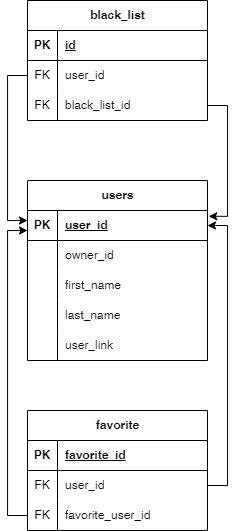

# Командный проект по курсу «Профессиональная работа с Python» VKinder
## Цель проекта
Цель командного проекта — разработать программу-бота для взаимодействия с базами данных социальной сети. Бот будет предлагать различные варианты людей для знакомств в социальной сети ВКонтакте в виде диалога с пользователем.

## Задачи проекта

1. Разработать программу-бота на Python,
2. Спроектировать и реализовать базу данных (БД) для программы,
3. Настроить взаимодействие бота с ВКонтакте,
4. Написать документацию по использованию программы.

## Описание проекта
Взаимодействие с сайтом Вконтакте происходит за счет работы API Вконтакте, в ходе которого необходимо получить ключ-доступа (access token), в дальнейшем используемый для получения данных о пользователя (имя, фамилия, возраст, пол, город), фотографий и поиска людей для знакомства.

Функционал бота Вконтакте реализован на основе модуля *api_vk*, для получения или отправки сообщений используется *Long Poll API*. Бот работает через сообщество Вконтакте, от которого так же нужно получить ключ-доступа (access token).

База данных создается автоматически с помощью скрипта, который основан на *psycorg2* и *SQLAlchemy ORM*.

## Инструкция для запуска проекта
Для начала работы необходимо создать *.env* файл и записать в него значения следующих переменных:

    VK_TOKEN = access token, полученный от приложения Вконтакте
    TOKEN_BOT = access token, полученный от сообщества Вконтакте

#### Для работы с БД:

    PASSWORD = пароль
    NAME_DB = название БД (прописными латинскими буквами)
    LOGIN = логин
    DRIVER = postgresql/mysql
    HOST = localhost
    PORT = номер порта/5432

#### БД составлена по схеме:

## Программа запускается от файла main.py. Для начала взаимодейсвия с ботом, нужно написать ему "привет".

### Структура файла class_bot.py

Файл содержит реализацию класса Bot, а так же код для создания и взаимодействия с ботом через кнопки (VkKeyboard)

Функции класса Bot:
1. __init__() - инициализация класса Bot, в переменной *self.session* указан access token(*TOKEN_BOT*), записанный в файле *.env*;
2. **send_msg()** - функция получает id пользователя Вконтакте, которому отправит сообщение. Принимает:
   
        -метод, 
        -id Вконтакте пользователя, 
        -сообщение, 
        -идентификатор для избежания одних и тех же сообщений, 
        -кнопки для интерфейса взаимодействия в чате с ботом,
        -oбъект или несколько объектов, приложенных к ответу бота

3. **func_main()** - функция, которая обрабатывает полученное от пользователя сообщение, и в зависимости от команды пользователя, запускает ниже перечисленные функции.
4. **send_first_msg()** - функция-приветствие, запускается, если пользователь напишет боту "привет". В данном скрипте с помощью API Вконтакте в функции **get_user_info()** из модуля *class_vk.py* вытягиваются данные пользователя - если в профиле пользователя отсутствуют город и дата рождения, то отрабатывают функции **get_city()** и **get_birthday()**, запрашивающие у пользователя необходимые данные и результат записывается в переменные. **add_new_user()** из модуля *db.py* записывает данные пользователя, который написал боту, в БД.
5. **send_candidate_info ()** - функция для отправки кандидатов для знакомства, если пользователь нажмет на кнопку "найти пару". Сначала в функции **check_users()** из модуля *db.py* происходит проверка, есть ли "кандидат" в БД, для избежания дубликатов. 
   
    Если его нет в БД, то с помощью **search_couple()**, используя данные пользователя в *self.users*, подбирается кандидат для знакомства и добавялется в БД. Бот отправялет пользователю информацию о кандидате (имя, фамилия, ссылку на страницу Вконтакте) и три его фотографии, с наибольшим количеством лайков. Если фотографий на странице меньше трех, то отпраляются все. Если же кандидат уже есть в БД, то переменная *offset* увеличивается на 1, для выбора следующего кандидата.
6. **add_favorite()** - функция для добавления кандидата в БД в Избранные, если пользователь нажмет на кнопку "В избранное".
7. **add_black_list()** - функция для добавления кандидата в БД в Черный список, если пользователь нажмет на кнопку "В черный список".
8. **show_favorite()** - функция для показа пользователю списка избранных из БД, если пользователь нажмет на кнопку "Избранные".
   

### Структура файла class_vk.py
Файл содержит реализацию класса **VK** и функцию по сортировке фотографий.

Функции класса VK:
1. __init__() - инициализация класса **VK**, в переменной *self.vk_api* указан access token(**VK_TOKEN**), записанный в файле **.env**;
2. **get_user_info()** - функция для получения данных пользователя, который напишет боту. Принимает user_id, который получает бот в методе **func_main()** из модуля *class_bot.py*. Возвращает словарь в виде:
   
        {'owner_id': id пользователя,
        'first_name': имя пользователя,
        'last_name': фамилия пользователя,
        'age': возраст пользователя,
        'gender': противоположный от своего пол,
        'city': id города пользователя,
        'user_link': ссылку Вконтакте пользователя}

3. **get_city_id()** - функция для получения id города пользователя, т.к. API Вконтате для реализации метода *users.search* необходимо id, автоматически вычисляемое от названия города. На вход принимает название города и возвращает его id или *None*, если город не указан в профиле пользователя.
4. **get_photo()** - функция, для получения фотографий пользователя. На вход принимает id пользователя и возращает строку в виде *attachment*.
5. **search_couple()** - функция для поиска пары(кандидатов). На вхыд принимает словарь, полученный из функции **get_user_info()** и ориентируясь на значения, возращает словарь с данными кандидата в виде:
   
        {'owner_id': id Вконтакте кандидата,
        'first_name': имя кандидата,
        'last_name': фамилия кандидата,
        'user_link': ссылка Вконтакте кандидата}

Функция **photo_data_preparation()** сортирует фотографии пользователя, в зависимости от количества лайков. Вызывается внутри метода **get_photo()** класса **VK**.

### Структура файла db.py
Файл содержит скрипт для работы с Базой данных.

1. **create_delete_db()** - функция для удаления БД, если такая уже существует и ее создания. Принимает на вход название БД, команду и условия. Взаимодействие происходит через библиотеку *psycopg2*, параметры содержат логин, пароль и драйвер БД, записанные в файле *.env*;
2. **create_connection_db()** - функция для создания объекта-движка, для соединения с БД. Возращает объект *engine*, который принимает все параметры, указанные в файле *.env* "Для работы с БД". Далее *engine* используется для создания объекта-сессии *session*.
3. **check_users()** - функция для проверки, есть ли пользователь в БД в отношении Users. На вход принимает id пользователя и возвращает bool значение.
4. **add_new_user()** - функция для добавления пользователей в БД в отношение Users. На вход принимает строковые значения в соответствии с атрибутами отношения, которые получают функции get_user_info() и search_couple() из модуля class_vk.py.
5. **add_favorite()** - функция для добавления пользователей в БД в отношение Favorites. Принимает на вход два словаря - с данными пользователя, который написал боту и пользователя, которого бот предложил как кандидата для знакомства. Заполнение отношения происходит за счет внешних ключей user_id отношения Users.
6. **add_black_list()** - функция для добавления кандидатов в БД в отношение Blacklis. Заполнение отношения так же происходит за счет внешних ключей user_id отношения Users.
7. **show_fav_list()** - функция для вытягивания данных пользователей, которые были добавлены в отношение Favorites. На вход принимает id пользователя, и, соответствующие ему кандидаты будут возвращены в переменной result.

### Структура файла model.py
Файл содержит классы Users, Favorites, Blacklist с структурой отношений в БД. Классы являются дочерними от объекта Base, который хранит информацию о структуре БД.
1. **class Users** - отношение, содержащий информацию о всех пользователях, которые написали боту и были предъявлены как кандидаты для знакомства с этим пользователем. Атрибутами являются **user_id** (primary key), **owner_id** с id Вконтакте пользователя, **first_name** с именем пользователя, **last_name** с фамилией пользователя и **user_link** с ссылкой на Вконтакте пользователя.
2. **class Favorites** - отношение, содержащее такие атрибуты, как **id** (primary key), **user_id** (foreign key) и **favorite_user_id** (foreign key). Оба внешних ключа связаны с атрибутом **user_id** отношения Users. Содержит id тех пользователей, которые были добавлены в отношение "Избранные" методом **add_favorite()** модуля *db.py*.
3. **class Blacklist()** - отношение, содержащее такие атрибуты, как **id** (primary key), **user_id** (foreign key) и **black_user_id** (foreign key). Оба внешних ключа связаны с атрибутом user_id отношения Users. Содержит id тех пользователей, которые были добавлены в отношение "Черный список" методом **add_black_list()** модуля *db.py*.
4. **create_table()** - функция для удаления и создания отношений при соединении с БД в модуле *db.py*.

### Структура файла main.py
Файл содержит вызовы всех классов и функций, необходимых для запуска программы. 
1. **create_delete_db()** из модуля *db.py* сначала удаляет, после создает БД, необходимуюдля работы программы. Параметрами являются название БД, команда удалить/создать и условие.
2. **create_table()** из модуля *db.py* создает соединение с БД.
3. **func_main()** - функция из модуля *class_bot.py*, для отработки взаимодействия с ботом и других функций, которые в нем вызываются.